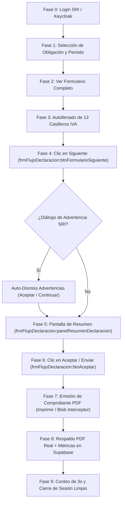

# 📖 MANUAL Y MAPA DE SELECTORES E IDs OFICIALES SRI ECUADOR (FORMULARIO 2011 - IVA)
### *Guía Maestra de Arquitectura, Dom Elements, Selectores y Flujo de Automatización Zero-Touch*

---

## 🗺️ 1. MAPA DEL FLUJO COMPLETO DE DECLARACIÓN (PASO A PASO)

---

## 🎯 2. TABLA MAESTRA DE SELECTORES E IDs DEL PORTAL SRI (`recibirDeclaracion.jsf`)

| Paso del Flujo | Elemento UI SRI | Selector / ID Principal | Selectores Alternativos / Fallbacks | Acción de la Extensión |
| :--- | :--- | :--- | :--- | :--- |
| **0. Inicio** | Splash / Loader | `#splash` / `.ui-blockui` | `div.ui-widget-overlay` | `waitForPortal()` (Esperar a que desaparezca el bloqueo) |
| **1. Obligación** | Dropdown Obligación | `#frmFlujoDeclaracion:somObligacion_label` | `.ui-selectonemenu-trigger` | Clic y seleccionar opción `2011 (IVA)` |
| **1. Periodo (Año)** | Dropdown Año | `#frmFlujoDeclaracion:somAnio_label` | `#frmFlujoDeclaracion:calPeriodo` | Seleccionar año (ej. `2026`) |
| **1. Periodo (Mes)** | Dropdown / Calendar Mes | `#frmFlujoDeclaracion:somMes_label` | `.ui-datepicker-month` / `findByText('JUL')` | Clic en el mes correspondiente (ej. `JULIO`) |
| **1. Siguiente Obligación** | Botón Siguiente Step 1 | `#frmFlujoDeclaracion:btnObligacionSiguiente` | `button[id*="btnObligacionSiguiente"]` | Clic en Siguiente para avanzar |
| **2. Preguntas** | Botón Siguiente Preguntas | `#frmFlujoDeclaracion:btnPreguntasSiguiente` | `findByText('Siguiente')` | Saltado automáticamente si no hay preguntas |
| **2. Formulario** | Botón Ver Formulario | `#frmFlujoDeclaracion:btnVerFormularioCompleto` | `findByText('Ver formulario completo')` | Clic para abrir el formulario IVA |
| **3. Casilleros Ventas** | Ventas 15% (401 -> 411) | `#concepto450` (401) / `#concepto460` (411) | `input[name*="450"]` | Autollenado espejo del valor de ventas |
| **3. Casilleros Ventas** | Ventas 0% (403 -> 413) | `#concepto570` (403) / `#concepto580` (413) | `input[name*="570"]` | Autollenado espejo del valor de ventas 0% |
| **3. Compras Total** | No. Comprobantes (115) | `#concepto256` | `input[id*="256"]` | Conteo total de comprobantes de compras |
| **3. Compras 15%** | Base Imponible 15% (500) | `#concepto1270` | `input[id*="1270"]` | Autollenado de compras grabadas 15% |
| **3. Compras 15%** | Monto 15% (510) | `#concepto1280` | `input[id*="1280"]` | Autollenado compras netas 15% |
| **3. Compras 0%** | Base Imponible 0% (507) | `#concepto1720` | `input[id*="1720"]` | Autollenado de compras 0% |
| **3. Compras 0%** | Monto 0% (517) | `#concepto1730` | `input[id*="1730"]` | Autollenado compras netas 0% |
| **3. Sugeridos** | Crédito Tributario (564) | `#concepto2130` | `concepto2130.sugerido` | Autollenado por lectura de sugerido SRI |
| **3. Retenciones** | Retenciones IVA (609) | `#concepto2200` | `input[id*="2200"]` | Autollenado de retenciones de IVA recibidas |
| **3. Resumen 615** | Crédito Mes Anterior (615) | `#concepto2220` | `concepto2220.sugerido` | Autollenado sugerido del SRI o cálculo |
| **3. Resumen 617** | Retenciones Mes Anterior (617) | `#concepto2230` | `concepto2230.sugerido` | Autollenado sugerido del SRI o cálculo |
| **4. Avance** | **Botón Siguiente Formulario** | `#frmFlujoDeclaracion:btnFormularioSiguiente` | `button[id*="btnFormularioSiguiente"]` | **Clic automático tras llenar los 13 casilleros** |
| **5. Advertencias** | Modal Advertencias SRI | `div.ui-dialog` / `#frmFlujoDeclaracion:panelDialogos` | `div[id*="dlgAdvertencia"]` | **`autoDismissSriWarnings` aprueba el cuadro emergente** |
| **6. Resumen** | Panel Resumen Impositivo | `#frmFlujoDeclaracion:panelResumenDeclaracion` | `#frmFlujoDeclaracion:panelResumen` | Confirmación de llegada a vista de resumen |
| **6. Confirmar** | **Botón Aceptar / Enviar** | `#frmFlujoDeclaracion:btnAceptar` | `#frmFlujoDeclaracion:btnEnviar` | **`initSummaryPageWatcher` presiona Aceptar** |
| **7. Éxito PDF** | Botón Imprimir Comprobante | `#frmFlujoDeclaracion:btnImprimirComprobante` | `a[id*="btnImprimir"]` / `findByText('Imprimir')` | Intercepción de 5 capas del Blob PDF oficial |
| **8. Supabase** | Sincronización Web App | `syncDeclarationToSupabase(...)` | REST Supabase Client API | **Sube PDF real + Métricas (Ventas, Compras, Ret)** |
| **9. Cierre** | Cierre Mágico | `ejecutarCierreMagico()` | `cerrarSesionSRI()` | **Conteo regresivo de 3s y Cierre de Sesión** |

---

## 🛡️ 3. REGLAS DE PROTECCIÓN Y CONTROL DE ESTADO

1. **Interruptor de Modo Manual (`autoDeclaration` / `sri_auto_mode`)**:
   - **Desactivado**: El robot NO hace nada solo. Muestra el panel flotante y espera que el usuario presione el botón deseado.
   - **Activado**: El robot ejecuta toda la secuencia Zero-Touch sin interrupciones.
2. **Protección Anti-Colisión (`initSummaryPageWatcher`)**:
   - NO presiona `Aceptar` mientras `concepto401` o los casilleros de edición estén en pantalla.
   - Solo actúa cuando el panel de resumen `#frmFlujoDeclaracion:panelResumenDeclaracion` está 100% activo.
3. **Captura del PDF Oficial**:
   - Espera hasta 8 segundos en bucle de 5 capas (`URL.createObjectURL`, `XHR`, `Fetch`, `window.open`, `DOM Scraper`).
   - Solo sube el archivo PDF binario real del SRI (`%PDF-1.4...`).
