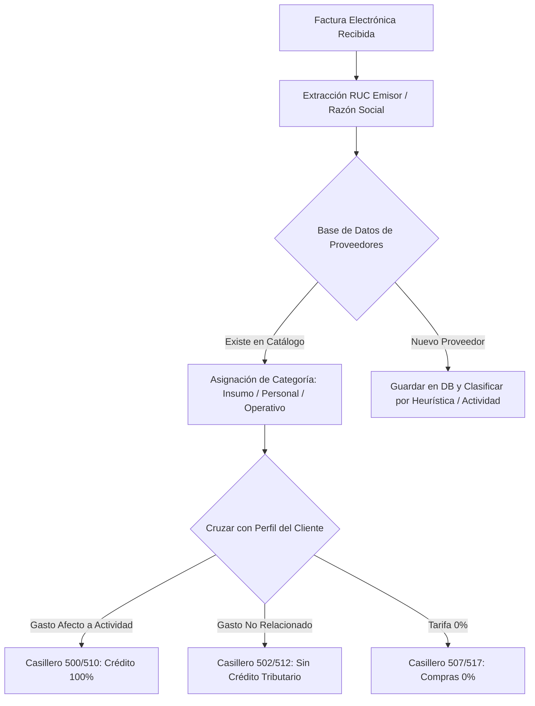

# Hoja de Ruta: Clasificación Inteligente de Proveedores y Crédito Tributario del IVA (SRI Ecuador)

> **Objetivo Registrado en Memoria Permanente:**  
> Implementar un catálogo dinámico y creciente de proveedores para clasificar automáticamente los comprobantes electrónicos recibidos según la actividad económica del cliente, garantizando la perfecta segregación del Crédito Tributario (100% vs Sin Crédito / Gastos Personales).

---

## 🏛️ Marco Tributario Oficial (SRI Ecuador)

De acuerdo con la **Ley de Régimen Tributario Interno (LRTI - Art. 66)** y su Reglamento:
1. **Crédito Tributario Total (100% - Casilleros 500 / 510):**
   - Aplica exclusivamente a las compras de bienes y servicios directamente vinculadas y necesarias para la generación de ingresos gravados con tarifa 15% del contribuyente.
2. **Adquisiciones sin Derecho a Crédito Tributario (Casilleros 502 / 512):**
   - Aplica a compras con tarifa 15% que no guardan relación directa con la actividad económica del contribuyente (ej. gastos personales de alimentación, vestimenta, ferretería no comercial, supermercado personal) o corresponden a actividades con tarifa 0% o exentas.
3. **Adquisiciones Tarifa 0% (Casilleros 507 / 517):**
   - Compras de insumos gravados con tarifa 0% (ej. productos de la canasta básica no procesados, medicinas, combustible diésel según segmento).
4. **Factor de Proporcionalidad (Casilleros 501 / 511):**
   - Para contribuyentes que venden simultáneamente con tarifa 15% y tarifa 0%.

---

## 🏗️ Arquitectura Propuesta (Para Implementación Futura)

### Componentes de la Solución:
1. **Tabla en Supabase `supplier_catalog`**:
   - `ruc` (13 dígitos)
   - `business_name` (Razón social)
   - `commercial_category` (ej. `combustible`, `supermercado`, `ferreteria`, `servicios_profesionales`, `alimentacion`)
   - `default_tax_credit_eligible` (boolean)
2. **Perfil del Contribuyente (`client_economic_activities`)**:
   - Actividades registradas en el RUC (servicios profesionales, comercio, transporte, etc.).
3. **Motor de Segregación en `05_llenado_formulario.js`**:
   - Durante la lectura de comprobantes recibidos, totalizar bases imponibles separadas:
     - `base15_con_credito` -> `concepto500` / `concepto510`
     - `base15_sin_credito` -> `concepto502` / `concepto512`
     - `base0` -> `concepto507` / `concepto517`
